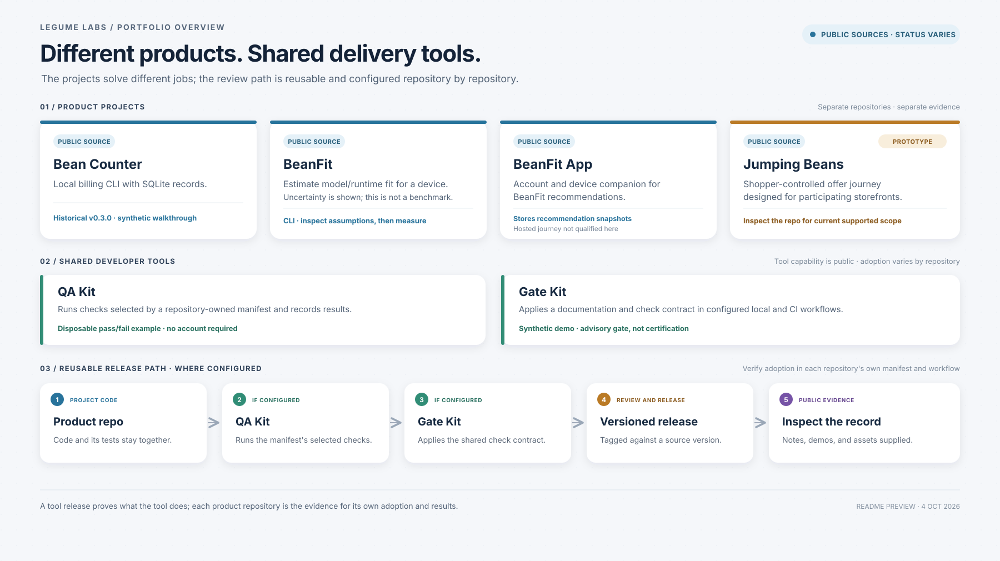
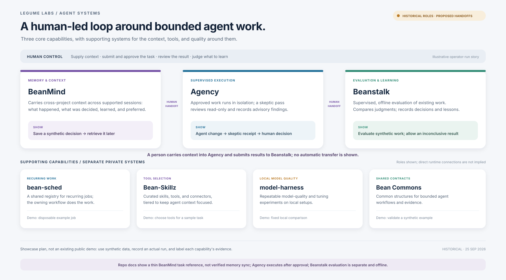

# Legume Labs: Products and Delivery

Public portfolio overview and source evidence refresh. Release identity is recorded in [GitHub Releases](https://github.com/stevekkall-beansgc/legume-labs/releases). The source observations below were made earlier on October 2, 2026; this refresh establishes no deployment, promotion or rights clearance.

Legume Labs is a portfolio of separate software products and experiments. The projects solve different problems; QA Kit and Gate Kit provide reusable delivery tools for repositories that adopt them.

This overview shows what each project helps with, what evidence a visitor can inspect, and where project status is confirmed. Start with a reproducible local demonstration below; a repository or release link alone is not proof of hosted availability, customer adoption, or publication clearance.

## Start with executable evidence

- **Check orchestration:** [QA Kit's synthetic quickstart at reviewed source](https://github.com/stevekkall-beansgc/qa-kit/blob/38c7a7bfc078038cfd624ef58d24315e7230e0fe/README.md#five-minute-public-showcase) runs the real manifest runner through a pass and two failure paths, using disposable fixtures. It demonstrates runner behavior, not fleet health.
- **Compliance boundaries:** [Gate Kit's synthetic demo at reviewed source](https://github.com/stevekkall-beansgc/gate-kit/blob/38741affd2034f9b110b4a302ecfc08c4046f722/README.md#2-run-the-synthetic-demo) exercises configured checks without a real service. Report-only workflow scanning is not a security certification.
- **Local AI estimates:** [BeanFit's five-minute path at reviewed source](https://github.com/stevekkall-beansgc/beanfit/blob/9a9dc02fb297a5c4ba3fe8938c96084f18adb7fb/README.md#five-minute-showcase) connects hardware detection, resident-memory fit, ranking and JSON assumptions. Speed bands are assumed, quality numbers are editorial, and MoE speed is not architecture-calibrated.

The [current public evidence index](docs/CURRENT-PUBLIC-EVIDENCE-20261002.md) binds these routes to exact source and records limitations. The [September 25 source register](SOURCE-REGISTER.md) and [initial October 2 baseline](docs/SHOWCASE-EVIDENCE-BASELINE-20261002.md) remain historical observations. See the [delivery guide](DELIVERY.md) for project boundaries and the [review runbook](docs/SHOWCASE-REVIEW-RUNBOOK.md) for the assessment procedure.

For repository editing rules and the static check, see [AGENTS.md](AGENTS.md).

GitHub Releases record changes to this portfolio overview. Project release versions remain tied to their individual repositories.

## At a glance

**Products and delivery**

**Agent systems**

## Public products

| Project | What it helps with | Public evidence and status observed earlier October 2 |
| --- | --- | --- |
| [Bean Counter](https://github.com/stevekkall-beansgc/bean-counter) | Keep billing records in a local SQLite database through a command-line workflow. | Public [v0.9.0 release](https://github.com/stevekkall-beansgc/bean-counter/releases/tag/v0.9.0) records native qualification on two specified platforms, with caveats and an open race-test follow-up. Begin with the [version-bound billing quickstart](https://github.com/stevekkall-beansgc/bean-counter/blob/2487dcfa9333b54c8622fd826e289fcaccb7ee22/docs/billing-quickstart.md). This is not a hosted billing service or payment processor. |
| [BeanFit](https://github.com/stevekkall-beansgc/beanfit) | Estimate whether model and runtime options may fit a device, with uncertainty made visible. | Public [v0.5.1 release](https://github.com/stevekkall-beansgc/beanfit/releases/tag/v0.5.1) and the pinned route above. Released source embeds package/runtime 0.5.0 and older status/support wording; that identity mismatch is unresolved in the published artifact. Estimates are not benchmark results. |
| [BeanFit App](https://github.com/stevekkall-beansgc/beanfit-app) | Companion account and device registration flow for BeanFit recommendations. | Public [v0.4.5 release](https://github.com/stevekkall-beansgc/beanfit-app/releases/tag/v0.4.5) and [version-bound customer-flow description](https://github.com/stevekkall-beansgc/beanfit-app/blob/b0e19438496d06786ab8043953f838a4d03b392d/README.md#beanfit-app). GitHub metadata lists [a service URL](https://beanfit-app.steve-k-kall.workers.dev/); this refresh did not qualify the hosted journey. Registration stores a recommendation snapshot; automatic refresh and delivered update alerts are not demonstrated by this evidence. |
| [Jumping Beans](https://github.com/stevekkall-beansgc/jumping-beans) | Explore a shopper-controlled offer journey designed for participating storefronts. | Public [showcase](https://devpost.com/software/jumping-beans) and [v0.11.0 release](https://github.com/stevekkall-beansgc/jumping-beans/releases/tag/v0.11.0). The September 25 overview recorded owner-confirmed frozen status; current work-state intent was not reconfirmed in this refresh. The demo does not claim live partner commerce or operations. |

**One engineering decision to inspect:** BeanFit keeps fit based on resident model memory, while its [estimate model](https://github.com/stevekkall-beansgc/beanfit/blob/9a9dc02fb297a5c4ba3fe8938c96084f18adb7fb/src/beanfit/engine/estimate.py) applies a static bandwidth formula. [Evaluation tests](https://github.com/stevekkall-beansgc/beanfit/blob/9a9dc02fb297a5c4ba3fe8938c96084f18adb7fb/tests/test_evaluate.py) and [CLI tests](https://github.com/stevekkall-beansgc/beanfit/blob/9a9dc02fb297a5c4ba3fe8938c96084f18adb7fb/tests/test_cli.py) exercise software behavior; they do not establish measured speed or calibrated uncertainty coverage. Inspect both the implementation and that limitation before relying on a recommendation.

## Shared developer tools

These public tools help teams describe and run checks. Check a repository's own manifest and workflow to see whether it uses them; the [delivery guide](DELIVERY.md) explains what to look for.

| Tool | Role | Evidence |
| --- | --- | --- |
| [QA Kit](https://github.com/stevekkall-beansgc/qa-kit) | Runs checks selected by a repository-owned manifest and records results. | Pinned quickstart above · [v0.7.2 release](https://github.com/stevekkall-beansgc/qa-kit/releases/tag/v0.7.2). |
| [Gate Kit](https://github.com/stevekkall-beansgc/gate-kit) | Applies a documented check contract in configured local and CI workflows. | Pinned demo above · [v0.7.0 release](https://github.com/stevekkall-beansgc/gate-kit/releases/tag/v0.7.0). |

## Agent systems

Legume Labs also has three private agent systems: **BeanMind** for persistent context, **Agency** for human-approved execution and read-only skeptic review, and **Beanstalk** for evaluating work and recording lessons. The [agent systems showcase](AGENT-SYSTEMS.md) maps those roles alongside supporting systems for recurring work, tool selection, model quality, and shared contracts. The example is human-directed: Agency executes approved work, while people carry context and results between systems.

## What this overview does not claim

The diagram shows a reusable delivery path, not proof that every product uses every stage. A release or passing check establishes only the evidence it names; it does not by itself prove independent acceptance or general service availability.

These links describe project artifacts, not a complete personal contribution account. Builder, collaborator, inherited-asset and material AI-assistance boundaries still require owner-confirmed records before attributing the whole implementation to one person. Private-system demonstrations remain proposals, not recorded end-to-end evidence.
